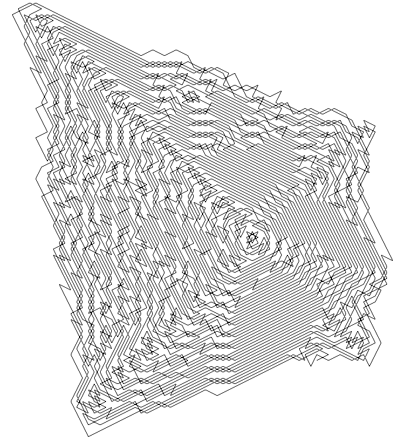

# TrappedKnight

A rewrite of [Numberphile's Trapped Knight program](https://www.youtube.com/watch?v=RGQe8waGJ4w)
Just run it with
```
# ./trappedKnight
# ./trappedKnight 300
```
The number is optional and indicates how many steps should be taken.


